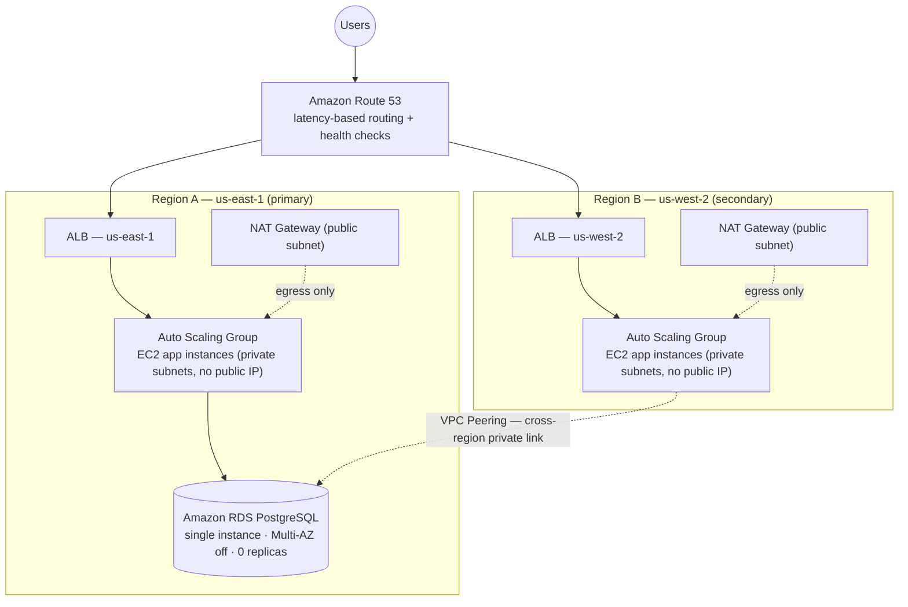
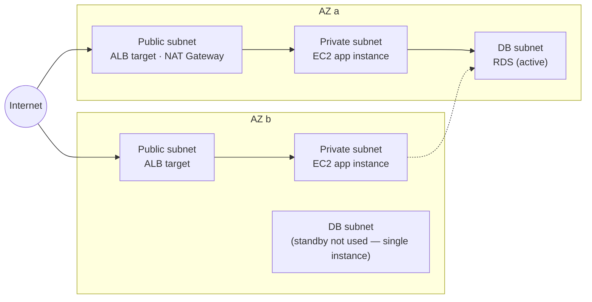

# Part 4 — AWS Cloud Architecture

Design for deploying the Notes application (FastAPI backend + Postgres +
static frontend) onto AWS, meeting the four Part 4 requirements:

1. The application scales horizontally.
2. Application instances have no public IP addresses.
3. The database runs on a managed cloud database service, as a single
   instance with no replicas.
4. Application instances are deployed across multiple regions.

No infrastructure has been provisioned yet — this is the design document
that precedes the Terraform/CDK work.

## 1. Requirement → design mapping

| # | Requirement | How it's satisfied |
|---|---|---|
| 1 | Horizontal scaling | An Auto Scaling Group per region, fronted by an Application Load Balancer, with a target-tracking scaling policy (CPU / ALB request count per target). Instance count grows and shrinks automatically with load. |
| 2 | No public IPs on instances | EC2 instances launch only in **private** subnets with "auto-assign public IP" disabled. The only internet-facing component is the ALB, a managed AWS service, not a customer instance. Outbound internet access (image pulls, patching) goes through a NAT Gateway. Instance access for operators is via **SSM Session Manager**, not SSH — no bastion host, no inbound port 22. |
| 3 | Managed DB, 1 instance, no replicas | Amazon RDS for PostgreSQL. Multi-AZ: **disabled**. Read replicas: **0**. One `db.*` instance, in one region. |
| 4 | Multi-region app deployment | The full regional stack (VPC, subnets, ALB, ASG) is duplicated in two AWS regions (e.g. `us-east-1` and `us-west-2`), both serving live traffic. Amazon Route 53 latency-based routing with health checks distributes users to whichever region is closer/healthy — active-active. |

## 2. Global topology

Only Region A has a database subnet group. Region B's application tier
reaches the same RDS instance over a private cross-region path — see
§5 for why, and the cost of that decision.

## 3. Per-region subnet layout

Each region gets its own VPC with a non-overlapping CIDR block (required
for VPC peering), spread across two Availability Zones for ALB/ASG
availability:

Example CIDRs:

| Region | VPC | Public subnets | Private app subnets | DB subnets |
|---|---|---|---|---|
| us-east-1 (A) | `10.0.0.0/16` | `10.0.0.0/24`, `10.0.1.0/24` | `10.0.10.0/24`, `10.0.11.0/24` | `10.0.20.0/24`, `10.0.21.0/24` |
| us-west-2 (B) | `10.1.0.0/16` | `10.1.0.0/24`, `10.1.1.0/24` | `10.1.10.0/24`, `10.1.11.0/24` | none |

RDS requires a DB subnet group spanning ≥2 AZs even when only one
instance is running — that's an AWS mechanical requirement, not a
second instance. No standby is deployed into the second AZ subnet.

## 4. Component detail

**Compute** — Auto Scaling Group per region, Launch Template running the
existing backend container, target group health check on the app's
existing `GET /health` endpoint. Illustrative sizing: min 2 / desired 2 /
max 6 per region. (ECS Fargate is an equally valid substitute: tasks in
`awsvpc` mode with no public IP assigned satisfy requirement 2 natively,
and Service Auto Scaling satisfies requirement 1.)

**Load balancing** — one internet-facing ALB per region, in the public
subnets, HTTPS listener with a regional ACM certificate, forwarding to
the private-subnet ASG targets.

**Egress without ingress** — a NAT Gateway per region (per-AZ for
production HA) lets private instances reach ECR, Secrets Manager, and
OS package repos outbound, without ever accepting inbound connections
from the internet.

**Operator access** — AWS Systems Manager Session Manager, via an IAM
instance role with `AmazonSSMManagedInstanceCore`. Replaces SSH/bastion
entirely, so there's no reason for an instance to ever hold a public IP
or an open inbound port.

**Database** — Amazon RDS for PostgreSQL, single instance, Multi-AZ
disabled, 0 read replicas, DB subnet group in Region A's private DB
subnets. Security group allows inbound `5432` only from the app-tier
security groups of both regions. Automated backups/snapshots are
enabled for durability — a backup is not a live replica, so this
doesn't conflict with the "0 replicas" requirement.

**Cross-region connectivity** — a VPC peering connection between the
two regional VPCs (Transit Gateway would only be worth the extra cost
at 3+ regions), with route table entries in both private subnets
pointing the peer CIDR at the peering connection. Region B's app
instances reach Region A's RDS security group through this link.

**Global traffic routing** — Route 53 latency-based routing records for
both regional ALBs, with health checks against each region's `/health`
endpoint, so an unhealthy region is automatically taken out of
rotation. (AWS Global Accelerator is a viable alternative if
sub-second failover and a static anycast IP matter more than the
simpler Route 53 setup.)

**Images & secrets** — Amazon ECR with a cross-region replication rule,
so each region pulls the app image from a local registry rather than
across regions. DB credentials in AWS Secrets Manager, replicated to
Region B so its app tier can resolve the connection string without
hardcoding it.

## 5. Trade-off: one database, two regions

Requirements 3 and 4 pull in opposite directions on purpose, and it's
worth naming the tension rather than glossing over it:

- The RDS instance lives in exactly one region. Region B's entire app
  tier depends on a private cross-region link to reach it — every query
  from Region B pays cross-region round-trip latency (roughly 60–80 ms
  between `us-east-1` and `us-west-2`), on top of normal query time.
- The database is a single point of failure for **both** regions: if
  Region A (or just its RDS instance) goes down, Region B's app tier
  loses its data layer too, even though Region B's compute and ALB are
  still healthy. Multi-region *compute* does not buy multi-region
  *availability* here, because the requirement explicitly rules out the
  usual fix (a cross-region read replica or Aurora Global Database).
- This is a direct, spec-mandated consequence of requirement 3, not an
  oversight. If the constraint ever relaxes, the standard fix is Aurora
  Global Database (one writer region, fast-lagging read replicas in
  others) or promoting a cross-region read replica — both of which are
  explicitly out of scope here.
- Mitigations that stay inside the constraint (worth mentioning, not
  implemented): an RDS Proxy in front of the instance to pool
  connections from both regions and shrink connection-setup overhead
  from Region B; an in-region cache (ElastiCache) for read-heavy
  endpoints to mask cross-region latency for reads. Neither adds a
  database instance or replica.

## 6. Free Tier considerations

This design is written for correctness first, but the reference account
for this capstone is an AWS Free Tier account, so it's worth splitting
"what's free" from "what isn't" before provisioning anything.

**Free tier eligible, as designed:**

- RDS: single instance, Multi-AZ off, `db.t3.micro`/`db.t2.micro` — 750
  instance-hours/month for 12 months. This lines up exactly with
  requirement 3; no substitution needed.
- EC2 `t2.micro`/`t3.micro` app instances — 750 instance-hours/month.
  This pool is **account-wide across all regions combined**, not 750
  per region — running instances in both regions at once consumes it
  twice as fast.

**Not free tier eligible — the parts that quietly generate a bill:**

- **NAT Gateway** — never free tier. ~$0.045/hr plus per-GB data
  processing, roughly $32+/month per gateway, and this design has one
  per region. This is the single line item most likely to surprise a
  student account.
- **ALB** — a limited free allowance exists (750 hrs + 15 LCU-hrs/month
  for 12 months), enough for about one ALB running continuously.
  Running two at once for a full month will exceed it modestly.
- **Route 53** — ~$0.50/month per hosted zone, ~$0.50/month per health
  check. Small, but not zero.
- **Cross-region data transfer** — VPC peering egress and inter-region
  traffic aren't covered by the free tier, though the volume from
  manual testing is negligible.

**Adjustments for running this on Free Tier:**

1. Replace the NAT Gateway with a **NAT instance** (a `t3.micro` with
   source/destination check disabled, doing IP forwarding) in each
   region. It rides the free EC2 hours instead of billing separately.
   Note in any writeup that production would use NAT Gateway instead,
   for its managed availability — the substitution is a cost decision,
   not a correctness one.
2. Keep each region's ASG desired capacity at 1 while demoing, to
   avoid exhausting the shared 750 EC2 hours across two regions.
3. Only run **both regions simultaneously** for the window actually
   being demoed or graded; scale down or terminate outside that
   window rather than leaving the stack up continuously.
4. Set an **AWS Budget alert** (e.g. $10) before provisioning anything
   — the cheapest safeguard against an unnoticed NAT Gateway or a
   forgotten second-region stack.
5. Route 53 and cross-region transfer costs stay in the range of a
   few dollars for short-lived testing and don't need a substitution.

## 7. Out of scope for this design

- Terraform/CDK implementation (next step once this design is approved).
- Aurora Global Database / cross-region read replicas — disallowed by
  requirement 3.
- CI/CD pipeline for building and deploying the container image.
